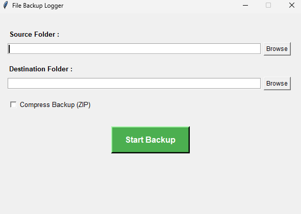
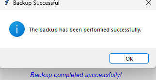

# File Backup Logger

A robust and user-friendly Python application designed to backup files and directories with versioning, log all operations locally, and provide a graphical user interface (GUI) for ease of use. This project fulfills Assignment II, focusing on Object-Oriented Programming (OOP) principles.

## Features

* **Folder Backup:** Recursively copies entire source folders to a specified destination.
* **Versioning:** Automatically appends a timestamp and version number to backup folder names (e.g., `MyProject_2025-07-24_v1.0.0`).
* **ZIP Compression:** Option to compress backups into a single `.zip` archive.
* **Detailed Logging:** Logs all backup operations, including status (success/failure), duration, and the number of files backed up. Logs are stored in `logs/backup.log`.
* **User Preferences:** Stores source folder, destination folder, and compression preferences in a `config.json` file for persistence.
* **Graphical User Interface (GUI):** Built with `tkinter` for easy interaction.
* **Error Handling:** Robust error handling for non-existent folders, permission issues, and other common problems.

## Getting Started

Follow these instructions to get a copy of the project up and running on your local machine.

### Prerequisites

* Python 3.x (Recommended: Python 3.8 or newer)

### Installation

1.  **Clone the repository:**
    ```bash
    git clone https://github.com/WilEdge/Erasmus-Task-3.git
    ```

2.  **Install required packages:**
    This project primarily uses built-in Python modules (`shutil`, `os`, `datetime`, `logging`, `zipfile`, `tkinter`, `json`). No external `pip` packages are strictly required.

### Running the Application

1.  **Run the main application file:**
    ```bash
    python main.py
    ```

## How to Use

The application features a simple graphical interface.

1.  **Launch the Application:**
    Run `main.py` as described in the "Running the Application" section. The main window will appear.

    

2.  **Select Source Folder:**
    Click the "Browse" button next to "Source Folder :" to choose the directory you wish to backup.

    

3.  **Select Destination Folder:**
    Click the "Browse" button next to "Destination Folder :" to choose where your backups will be stored. This is where the new backup folders/ZIP files will be created.

4.  **Choose Compression Option (Optional):**
    Check the "Compress Backup (ZIP)" checkbox if you want your backup to be saved as a single `.zip` file. If unchecked, the source folder will be copied as a new folder.

    

5.  **Start Backup:**
    Click the "Start Backup" button to initiate the backup process.

    

6.  **Backup Completion:**
    Upon successful completion, a "Backup Successful" message box will appear, and the status message in the application will update. In case of an error, an "Backup Failed" message will be shown, prompting you to check the logs.

    

7.  **Check Backup in Destination:**
    Navigate to your chosen destination folder to see the newly created backup.


8.  **View Logs:**
    All operations are logged in `logs/backup.log`. You can open this file with any text editor to review the history of your backups.

## Acknowledgements

* `shutil` module for file operations.
* `tkinter` for the GUI.
* `logging` for robust log management.
